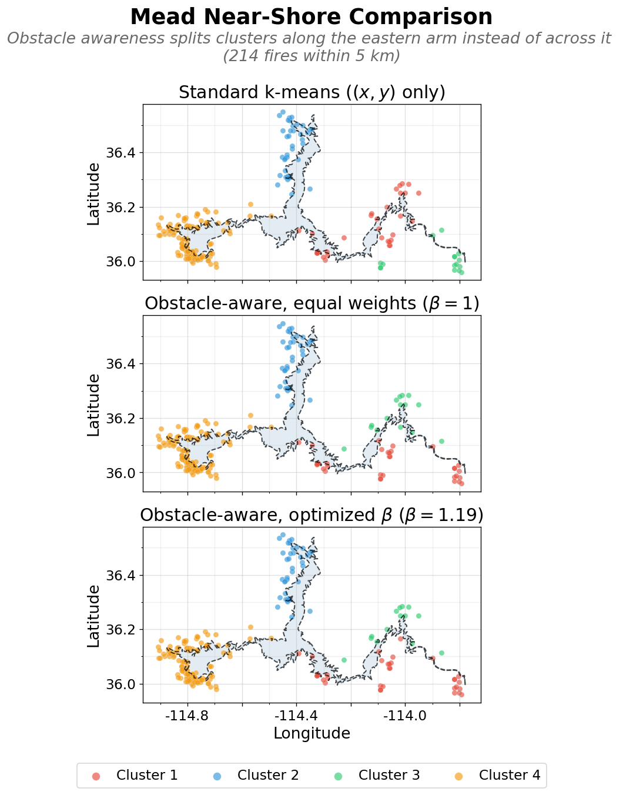

# Tailored k-means for Spatial Clustering with Obstacles: A Wildfire Case Study

Standard k-means groups points by straight-line distance, which is rarely the practical distance between objects in the real world. A lake, a highway, or a mountain range can change how close two points really are. This project develops an obstacle-aware version of k-means that adds a single feature - the arc-length position of each point along a closed obstacle boundary - and weights it against ordinary spatial distance through one tunable parameter. It is applied to wildfire records around two lakes of contrasting shape.

<p align="center">
  <br>
  <sub><em>Lake Mead, near-shore. Standard k-means (top) spreads one cluster across two arms of the reservoir; the obstacle-aware version (bottom) keeps each cluster on a single arm — the project's largest gain (+19%).</em></sub>
</p>

> 📊 **[Interactive dashboard — Lake Mead near-shore case](https://www.arcgis.com/apps/dashboards/b0a0e3a1258440ba86c61569bfea2185)** (ArcGIS Online)
>
> 📄 **[Full writeup (PDF)](obstacle-aware-kmeans.pdf)**

---

## Overview

For a point $\mathbf{x} = (x, y, s)$ and a centroid $\boldsymbol{\mu}$, the clustering distance is

$$d^2(\mathbf{x}, \boldsymbol{\mu}) = \alpha^2\,\lVert (x,y)-(x_\mu,y_\mu) \rVert^2 \;+\; \beta^2\, d_s(s, s_\mu)^2$$

where $s \in [0,1]$ is the point's position along the shoreline. We fix $\alpha = 1$ and let $\beta$ be the single dial. At $\beta = 0$ the shoreline term vanishes and the method is exactly standard k-means. As $\beta$ grows, position along the shore counts for more, and the clustering increasingly groups fires that share a stretch of shoreline. The shoreline distance $d_s$ is loop-aware: it measures the shorter way around the seam where $s = 0$ meets $s = 1$. The composite distance also admits an optional attribute term $\gamma$, held at zero throughout.

The method is applied to FPA FOD wildfire records (1992–2020) around two lakes:

- **Lake Tahoe** -- compact, roughly oval, perimeter 118.3 km, 1,068 fires
- **Lake Mead** -- long, multi-arm reservoir, perimeter 686.2 km, 844 fires

Each lake is analyzed at a basin scale and a near-shore scale, with $k = 4$ held fixed so any difference reflects lake geometry rather than a different number of clusters. The primary metric is the mean arc-length span: the shortest arc of shoreline containing all of a cluster's fires, averaged over clusters. Lower means tighter shoreline grouping.

## Results

| Lake / scale     | Fires | Standard | Optimized | Improvement |
|------------------|------:|---------:|----------:|------------:|
| Tahoe basin      | 1,068 | 31.3 km  | 28.8 km   | +8.1%       |
| Tahoe near-shore |   296 | 26.6 km  | 26.6 km   | 0.0%        |
| Mead basin       |   844 | 234.1 km | 217.0 km  | +7.3%       |
| Mead near-shore  |   214 | 166.4 km | 134.8 km  | +19.0%      |

At the basin scale both lakes improve by similar percentages. At the near-shore scale they diverge: Tahoe shows no change while Mead gives the project's largest gain. The obstacle parameter helps to the extent that a lake's shape makes shoreline distance differ from straight-line distance. On Tahoe's compact oval, a fire's position around the shore is closely determined by its coordinates near the lake, so the arc-length feature is largely redundant. On Mead's multi-arm shape, two fires can sit close in straight-line distance while being far apart along the shore. The shore runs out to the tip of one arm and back before reaching the other, so the feature carries information the coordinates do not. The figures show the mechanism directly: standard k-means assigns one cluster across two arms of Lake Mead, and the obstacle-aware version splits it onto a single arm.

## Method

The arc-length position $s$ is found by projecting each fire onto the lake boundary - a closed cubic spline through the shoreline vertices - and converting the projection to normalized arc length so that equal steps in $s$ cover equal stretches of shore. Clustering keeps the structure of standard k-means but uses the composite distance in the assignment step; centroids update by taking the planar mean and projecting it back onto the boundary for the $s$ component, and seeding uses a k-means++ variant adapted to the same distance.

We choose $\beta$ by sweeping a 30-point grid and scoring each fit with the within-cluster distortion $J$ (computed at fixed unit weights so it stays comparable across the sweep). Rather than taking the grid minimum, which can be an isolated numerical spike, we keep the values that (1) have $J$ within tolerance of the minimum, (2) are stable, with at least one neighboring grid point also low- $J$, and (3) leave no cluster under 10 fires, then break the tie on smallest span. A synthetic toy problem (a thin ellipse with three point groups) confirms the feature works as designed: where straight-line distance pulls a point to the cluster on the wrong side of the obstacle, the arc-length parameter pulls it back.

Full derivations, figures, and the attribute analysis are in the [writeup](obstacle-aware-kmeans.pdf).

## Repository structure

```
.
├── README.md
├── LICENSE
├── environment.yml                      # conda environment spec
├── pyproject.toml
├── src/
│   └── obstacle_clustering/              # custom package, editable install
│       ├── __init__.py
│       ├── boundary.py                   # shoreline spline, projection, arc-length s
│       ├── distance.py                   # loop-aware composite distance
│       ├── clustering.py                 # obstacle-aware k-means
│       ├── optimization.py               # beta sweep and selection
│       └── visualization.py              # figures
├── notebooks/
│   ├── 01_toy_problem_ellipse.ipynb
│   ├── 02_tahoe_wildfires_clustered.ipynb
│   ├── 03_mead_wildfires_clustered.ipynb
│   └── 04_arcgis_dashboard.ipynb         # ArcGIS dashboard build (showcase; needs Esri tooling)
├── data/
│   ├── raw/                              # source downloads (not committed)
│   ├── boundaries/                       # processed lake boundary polygons
│   ├── processed/                        # cleaned fire records
│   └── cached/                           # intermediates (not committed)
└── report/
    ├── obstacle-aware-kmeans.tex
    └── obstacle-aware-kmeans.pdf
```


## Quick Start - Notebooks

The notebooks are the core of the project. They render directly on GitHub, code and figures inline, so the quickest way to read the project is to click through them in order. 

1. **[01 — Toy problem (synthetic ellipse)](notebooks/01_toy_problem_ellipse.ipynb)** - *start here.* A clean case where the arc-length feature recovers the correct grouping and standard k-means does not.
2. **[02 — Lake Tahoe](notebooks/02_tahoe_wildfires_clustered.ipynb)** - basin and near-shore, the compact-oval case.
3. **[03 — Lake Mead](notebooks/03_mead_wildfires_clustered.ipynb)** - the multi-arm case; the near-shore result is the project's largest gain.
4. **[04 — ArcGIS dashboard](notebooks/04_arcgis_dashboard.ipynb)** - how the interactive dashboard was built in ArcGIS Online. This one uses Esri tooling outside the conda environment, so it's included to document the work rather than to be re-run.

## Full pipeline

To reproduce everything from scratch, including downloading raw data:

```bash
git clone https://github.com/REPLACE_USER/REPLACE_REPO.git
cd REPLACE_REPO
conda env create -f environment.yml
conda activate obstacle-clustering
pip install -e .
jupyter lab
```

Then run notebooks 01–03 in order. Notebook 04 is a showcase of the ArcGIS dashboard build and isn't part of this environment. The large raw datasets are not committed - see below to obtain them.

## Data sources

| Source | Use |
|--------|-----|
| **FPA FOD** (Short, 1992–2020) | Wildfire occurrence records |
| **NHD** (National Hydrography Dataset) | Lake boundaries — Tahoe layer 10 (Tahoe Keys region thinned); Mead layer 12 (features above 1 km² unioned, including the eastern arm NHD splits across HUC8 boundaries) |
| **TRPA** | Tahoe basin boundary |

Boundary polygons are simplified with Douglas–Peucker (≈100 m for Tahoe, ≈450 m for Mead) and fit with a closed cubic spline before projection.

## References

- McMahon et al. (2022), *Unsupervised learning methods for efficient geographic clustering and identification of disease disparities…*, Health Care Management Science. The dual-domain framing — two kinds of features combined in a tuned non-Euclidean distance — is adapted here for two views of the same geography.
- Short, K. C. (2022), *Spatial wildfire occurrence data for the United States, 1992–2020 (FPA_FOD)*, 6th Edition. Forest Service Research Data Archive.
- U.S. Geological Survey, *National Hydrography Dataset (NHD)*.
- Tahoe Regional Planning Agency, *Tahoe Basin Boundary*.

## Acknowledgements

Thanks to Dr. Mansoor Haider (North Carolina State University), who suggested the tailored obstacle-aware k-means idea and guided the method's development.

## Author

**Michele Perry** — MS, Applied Mathematics. Portfolio project for environmental science / GIS roles.

## License

Released under the [MIT License](LICENSE). 